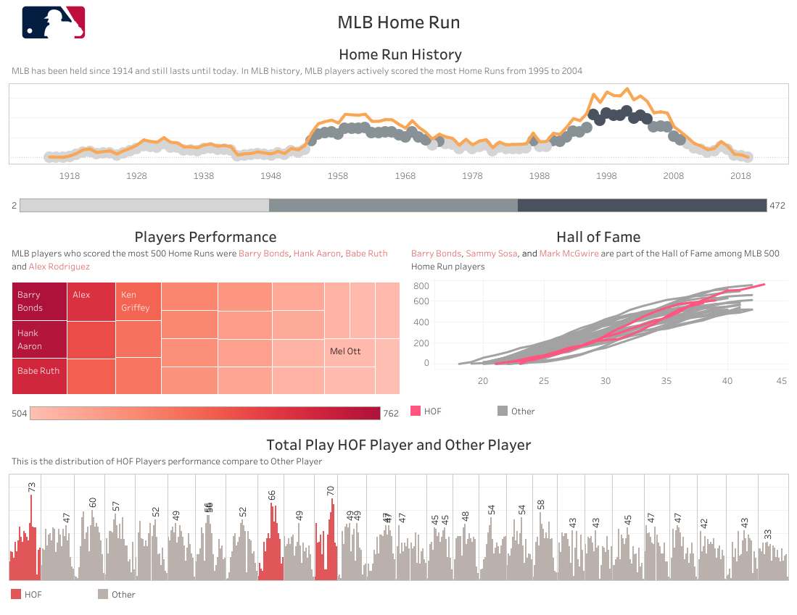

# MLB 500 Home Run

Insights of Major League Baseball data from 1914 to 2019. The data contained players who earned 500 Home Runs and their track records. This data source comes from the public tableau site

Please visit my tableau public profile to view the visualization
https://public.tableau.com/app/profile/laila/viz/MLB500HomeRun/Dashboard1

## Home Run History
MLB has been held since 1914 and still lasts until today. Home runs scoring in MLB history can be divided into 3 parts namely high, medium and low.
In MLB history, the players scored the highest number of home runs from 1996 to 2004 with more than 350 home run scores. The players scored the highest number of home runs in 1954-1973, 1990-1995 and 2005-2009 with the number of home run scores 150-350 times.

## Players Perfomance
As of 2019, there are 27 players who entered **the 500 Home Run Club**. Of those members, Barry Bonds, Hank Aaron and Babe Ruth are the three players with the most Home Run scorers with more than 700 runs. Barry Bonds scored 762 times, Hank Aaron scored 755 times and Babe Ruth 714 times.

## HOF players
The Hall of Fame is a player selected by at least 75% of baseball writer's associaton of America members. Among the 500 Home Run Club members, three are inducted into **the Hall of Fame Club** : Barry Bonds, Sammy Sosa and Mark McGwire.

## HOF Players vs Other Players Record

